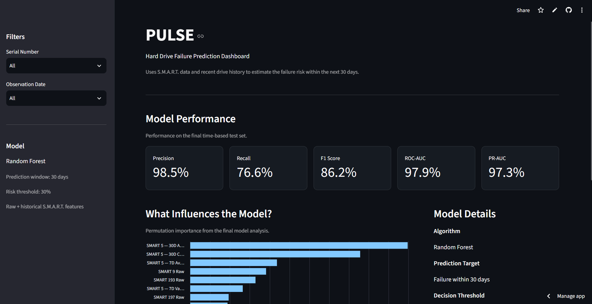
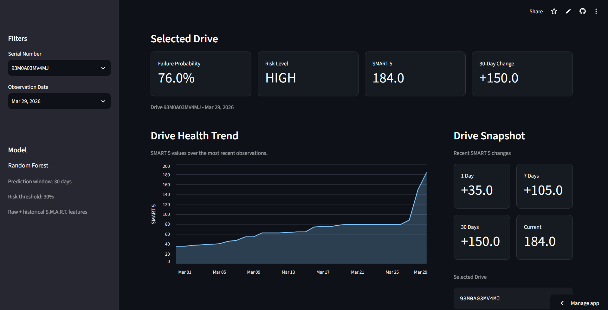

# Pulse

Pulse is a machine learning project that predicts if a hard drive wukk fail within the next 30 days using S.M.A.R.T. data from the Backblaze Drive Stats dataset. The model uses the current health data of a drive with features that show how its S.M.A.R.T. values have changed over time. The final model uses Random Forest and returns the probability that a drive may fail within the next 30 days. A Streamlit dashboard was also made to show the model results and test predictions using drives from the dataset.

## Live Demo

[View the Pulse Dashboard](https://pulse-drive-prediction.streamlit.app/)

## Dashboard



### Drive Prediction

The dashboard can also show the prediction and recent health history for a selected drive.



## How It Works

```text
Backblaze Drive Data
        |
        |--> Data Cleaning
                  |
                  |--> 30-Day Failure Labels
                                |
                                |--> Feature Selection
                                            |
                                            |--> Drive History Features
                                                          |
                                                          |--> Model Training
                                                                    |
                                                                    |--> Failure Probability
                                                                                |
                                                                                |--> Streamlit Dashboard
```

## Dataset

Pulse uses the Backblaze Drive Stats dataset, which contains health data collected from storage drives running in Backblaze data centers with each row representing one drive on one specific day.

Some of the main columns are:

- `date`: date the drive was observed
- `serial_number`: identifies the individual drive
- `model`: model of the drive
- `failure`: whether the drive failed that day
- `smart_*`: S.M.A.R.T. health measurements reported by the drive

### S.M.A.R.T. Telemetry

S.M.A.R.T. stands for Self-Monitoring, Analysis and Reporting Technology. The hard drives report different health statistics such as error counts, operating time, temperature and reallocated sectors. Pulse uses these measurements to look for patterns that can happen before a drive fails.

## Prediction Goal

The original Backblaze `failure` column only tells us if a drive failed on that specific day:
- `0`: drive did not fail that day
- `1`: drive failed that day

Pulse is meant to give an earlier warning instead of only detecting the day that a drive fails.

A new target called `failure_within_30_days` was created:
- `0`: the drive will not fail within the next 30 days
- `1`: the drive will fail within the next 30 days

The dataset contains historical data so the drives that eventually failed are already known which makes it possible to label the days leading up to each failure.

For example, if a drive failed on March 20:
- February 10 → failure is 38 days away → `0`
- February 25 → failure is 23 days away → `1`
- March 10 → failure is 10 days away → `1`
- March 19 → failure is 1 day away → `1`

The model can then learn patterns that are different between normal drive data and data from drives that are getting closer to failure.

## Data Preparation

The original Backblaze data contains many S.M.A.R.T. columns and many of them have missing values.

The data preparation included:
- Combining the Backblaze data files
- Converting dates into the correct format
- Removing features with too much missing data
- Creating the `failure_within_30_days` target
- Selecting useful S.M.A.R.T. features
- Sorting the data by date
- Creating features using previous drive data

The missing values used by the model are handled using median imputation.

## Drive History Features

The first version of the model only used S.M.A.R.T. values from the current day.

More features were added to show how SMART 5 changed over time:
- 1-day change
- 7-day change
- 30-day change
- 7-day rolling average
- 30-day rolling average
- Recent variation

This lets the model look at more than the current value. For example, two drives could have the same SMART 5 value today, but one could have stayed at that value while the other has been increasing and the history features help the model see this difference.

## Model Development

Different versions of the model were tested during the development and the first model used the selected raw S.M.A.R.T. features. Another version was then trained using both the raw features and the new drive history features. The model with the history features performed better, so those features were kept in the final model.

Other parts that were tested included:
- Random Forest parameters
- Time-based cross-validation
- Class weighting
- Different prediction thresholds
- False positives and false negatives
- Permutation feature importance

## Time-Based Splitting

The dataset was split based on date instead of randomly. The older data was used for training, newer data was used for validation and the latest data was saved for the final test. This makes more sense for this project because the goal is to use past drive data to predict future failures. A random split could mix older and newer observations together. The final test data was only used after the model and prediction threshold were already been selected.

## Prediction Threshold

The model returns a probability between 0 and 1 and then, a threshold is used to decide whether or not an observation should be classified as a possible failure.

Theses different thresholds were tested:

| Threshold | Precision |  Recall |   F1  |
| --------- | --------- | ------- | ----- |
|   0.50    |   99.2%   |  69.2%  | 81.5% |
|   0.40    |   97.5%   |  73.6%  | 83.9% |
|   0.30    |   94.1%   |  80.2%  | 86.6% |

The threshold of `0.30` was selected. Lowering the threshold caused more drives to be flagged, but it also helped the model catch more of the drives that would actually fail. For this project, catching more possible failures was more important than keeping the number of warnings as low as possible.

## Final Model

The final model uses:
- Random Forest
- Median imputation
- Raw S.M.A.R.T. features
- Drive history features
- 30-day failure target
- 0.30 prediction threshold

After selecting the model, it was trained again using both the training and validation data and then evaluated on the final test period. The trained model was saved using Joblib so the Streamlit dashboard can load it without training the model again every time the app starts.

## Final Test Results

| Metric          | Result |
| --------------- | ------ |
| Precision       | 98.5%  |
| Recall          | 76.6%  |
| F1 Score        | 86.2%  |
| ROC-AUC         | 97.9%  |
| PR-AUC          | 97.3%  |
| False Positives | 88     |
| False Negatives | 1763  |

The final model reached 98.5% precision which means that most of the observations that were flagged as possible failures were actually part of the failure class. The recall was 76.6%, meaning the model caught about three quarters of the positive observations in the final test data. The model still missed some failures, so improving the recall would be one possible improvement in the future.

## Feature Importance

Permutation importance was used to see which features had the biggest effect on the model.

|            Feature             | Importance |
| ------------------------------ | ---------- |
| SMART 5 30-Day Rolling Average |   0.1096   |
| SMART 5 30-Day Change          |   0.0857   |
| SMART 5 7-Day Rolling Average  |   0.0437   |
| SMART 9 Raw                    |   0.0382   |
| SMART 193 Raw                  |   0.0329   |
| SMART 5 7-Day Variation        |   0.0265   |
| SMART 197 Raw                  |   0.0194   |
| SMART 5 1-Day Change           |   0.0188   |
| SMART 5 7-Day Change           |   0.0172   |
| SMART 5 Raw                    |   0.0097   |

The SMART 5 30-day rolling average and 30-day change were the two most important features and this also showed that the history features were useful. Some of the features describing how SMART 5 changed over time were more important than the current SMART 5 value by itself.

## Dashboard

The trained model is connected to a Streamlit dashboard.

The main dashboard shows:
- Precision
- Recall
- F1 score
- ROC-AUC
- PR-AUC
- Feature importance
- Model information

A drive can be selected from the sidebar to view:
- Failure probability within 30 days
- Risk level
- Current SMART 5 value
- 1-day change
- 7-day change
- 30-day change
- Recent SMART 5 history

Different observation dates can also be selected for each drive and the dashboard uses Backblaze drive records included with the project. It is a demonstration of the trained model and is not connected to a live hard drive.

## Project Structure

```text
pulse/
|-- app.py
|-- assets/
|   |-- hard-drive-image.png
|   |-- pulse-dashboard.png
|   |-- pulse-drive-prediction.png
|
|-- data/
|     |-- processed/
|             |-- demo_data.csv
|
|-- models/
|     |-- pulse_model.joblib
|
|-- notebooks/
|-- requirements.txt
|-- README.md
```

## Technologies

- Python
- pandas
- NumPy
- scikit-learn
- Streamlit
- Altair
- Joblib
- Jupyter

## Running the Project

Clone the repository:

```bash
git clone https://github.com/Jenushan44/pulse.git
```

Go into the project folder:

```bash
cd pulse
```

Install the requirements:

```bash
pip install -r requirements.txt
```

Run the dashboard:

```bash
streamlit run app.py
```

## Conclusion

Pulse was able to use S.M.A.R.T. data to predict many hard drive failures before they happened. Adding drive history features improved the model because it could use how a drive's health changed over time instead of only looking at its current values. The feature importance results also showed that some of the 30-day history features were more useful than the current SMART 5 value by itself. The final model reached 98.5% precision, 76.6% recall, and an 86.2% F1 score on the final test data. The model still misses some failures, so there is room to improve the recall in the future. 